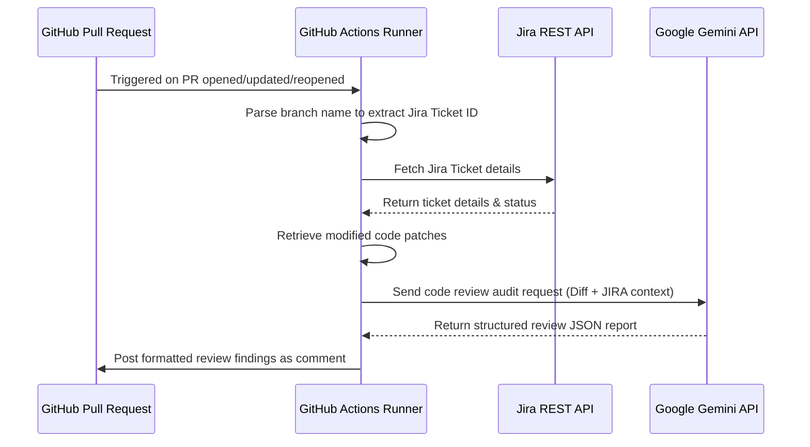

# PR Requirement Validator 🤖❌✅

This repository contains an automated Pull Request validator designed to audit code changes in Pull Requests against their corresponding JIRA ticket requirements using Google Gemini AI. 

All automation logic, scripts, and configurations are housed entirely within the **`.github`** folder.

---

## ⚙️ How the `.github` Workflow Works

The validation pipeline runs automatically inside GitHub Actions whenever a Pull Request is opened, updated (synchronized), or reopened.



---

## 📁 `.github` Folder Structure & File Breakdown

The following files inside the `.github` directory drive the automation:

```filepath
.github/
├── prompts/
│   └── review_prompt.txt     # System prompt instructing Gemini how to audit PRs
├── scripts/
│   ├── config.py             # Loads and exports required environment variables
│   ├── diff_utils.py         # Retrieves modified files and diff patches using GitHub API
│   ├── github_utils.py       # Handles PR commenting and formats AI output into markdown
│   ├── jira_utils.py         # Fetches Jira ticket fields and converts ADF text to Markdown
│   ├── llm_utils.py          # Orchestrates Gemini client requests, retries, and JSON parsing
│   ├── main.py               # Main driver script coordinating the validation steps
│   └── parser.py             # Extracts JIRA Ticket IDs from the git branch name via Regex
├── workflows/
│   └── pr-check.yml          # GitHub Actions workflow definition
└── requirements.txt          # Python dependencies (requests, google-genai)
```

### 1. Workflows
*   **`workflows/pr-check.yml`**: Configures the GitHub Actions runner environment. It triggers on PR activities, checks out the codebase, configures Python `3.10`, installs dependencies from `requirements.txt`, loads secrets as environment variables, and launches the Python entry script.

### 2. Prompts
*   **`prompts/review_prompt.txt`**: A prompt template containing system instructions for the AI reviewer. It forces Gemini to return a strict JSON format evaluating the PR against 6 key dimensions:
    1. **Requirement Compliance**: Ensuring 100% criteria fulfillment.
    2. **Logical Integrity**: Correctness of business logic.
    3. **Security & Privacy**: Checking for exposed API keys, hardcoded passwords, or vulnerabilities.
    4. **Code Maintenance**: Finding redundant, dead, or unused code and imports.
    5. **Scope Adherence**: Checking for modifications outside the ticket's scope.
    6. **Execution Reliability**: Audit for logical bugs, crash potentials, or missing exception handlers.

### 3. Scripts
*   **`scripts/main.py` (Workflow Orchestrator)**
    *   **Core Purpose**: Acts as the central runner and execution coordinator of the validation process.
    *   **Key Operations**:
        *   Loads runtime context parameters (`PR_TITLE`, `BRANCH_NAME`, `REPO`, `PR_NUMBER`) from the environment.
        *   Applies a strict status gatekeeper to verify that the ticket is in `"In Progress"` or `"In Review"`.
        *   Wraps the AI audit in a safety `try-except` block to capture system-level errors and report them cleanly on the PR.
*   **`scripts/parser.py` (Ticket ID Extractor)**
    *   **Core Purpose**: Extracts the target JIRA ticket ID from the development branch metadata.
    *   **Key Operations**:
        *   Uses a regular expression pattern (`[A-Z]+-\d+`) to scan the source branch string.
        *   Returns the matched ticket key (e.g., `TM-2`) or outputs a clean `None` value if it doesn't fit the convention.
*   **`scripts/jira_utils.py` (Jira Client & Parser)**
    *   **Core Purpose**: Integrates with JIRA Cloud to pull detailed ticket requirements.
    *   **Key Operations**:
        *   Communicates with the Atlassian REST API using credentials (`JIRA_EMAIL` and `JIRA_API_KEY`).
        *   Fetches the ticket's summary, type, workflow status, and description fields.
        *   Recursively parses Atlassian Document Format (ADF) JSON objects, exporting headers, bullet lists, code blocks, and tables into plain Markdown.
*   **`scripts/diff_utils.py` (GitHub Diff Client)**
    *   **Core Purpose**: Retrieves the exact code changes introduced by the developer.
    *   **Key Operations**:
        *   Queries GitHub's Pull Request Files API using the workflow's `GITHUB_TOKEN`.
        *   Builds a clean file checklist context containing file names, modification statuses (`added`, `modified`, `deleted`), and raw diff patches.
*   **`scripts/llm_utils.py` (Gemini API Connector)**
    *   **Core Purpose**: Coordinates content generation and structures safety checks with Google Gemini.
    *   **Key Operations**:
        *   Initializes the `google-genai` client using `GEMINI_API_KEY`.
        *   Assembles the prompt using `.github/prompts/review_prompt.txt` and embeds both JIRA ticket markdown and Git diff context.
        *   Queries the `gemini-flash-latest` model.
        *   Implements retry logic for common connection failures (429, 500, 503) and handles safety finish exceptions.
        *   Extracts and returns the raw JSON block nested in Gemini's response payload.
*   **`scripts/github_utils.py` (PR Feedback Publisher)**
    *   **Core Purpose**: Formats raw AI evaluations and posts them onto the PR timeline.
    *   **Key Operations**:
        *   Maps audit status results (`APPROVED`, `WARNING`, `REJECTED`, `FAILED`) to descriptive visual icons.
        *   Builds a clean Markdown summary and lists individual identified findings (type, message, and actionable code suggestions).
        *   Posts the generated report to the PR using GitHub's Pull Request Comments endpoint.
*   **`scripts/config.py` (Configuration Store)**
    *   **Core Purpose**: Serves as a single source of truth for secrets and API endpoints.
    *   **Key Operations**:
        *   Reads all required environmental tokens and credentials safely from the running system.
        *   Exports global variables (`GITHUB_TOKEN`, `JIRA_API_KEY`, `JIRA_EMAIL`, `JIRA_URL`, `GEMINI_API_KEY`) for usage across scripts.

---

## 🔑 GitHub Secrets Configuration

To run this workflow successfully in GitHub Actions, you must add the following repository secrets under **Settings** -> **Secrets and variables** -> **Actions**:

| Secret Name | Description | Example / Source |
| :--- | :--- | :--- |
| `JIRA_URL` | Base URL of your Atlassian Jira site | `https://your-domain.atlassian.net` |
| `JIRA_EMAIL` | The email address associated with your Jira user account | `developer@yourdomain.com` |
| `JIRA_API_KEY` | API Token generated from your Atlassian Account Settings | Generate at [id.atlassian.com](https://id.atlassian.com) |
| `GEMINI_API_KEY` | API Key generated to access Google Gemini models | Generate in Google AI Studio |

> [!IMPORTANT]  
> The workflow requests access to write PR comments using the built-in `GITHUB_TOKEN`. Ensure your repository allows write permissions for GitHub Actions by going to **Settings** -> **Actions** -> **General** -> **Workflow permissions** and selecting **Read and write permissions**.

---

## 💻 Local Testing and Debugging

You can test the Python scripts inside the `.github` folder locally.

1. Install Python `3.10+` and required dependencies:
   ```bash
   pip install -r .github/requirements.txt
   ```

2. Export the required credentials and target PR details into your terminal environment:
   ```powershell
   # Windows PowerShell
   $env:JIRA_URL="https://your-domain.atlassian.net"
   $env:JIRA_EMAIL="your-email@domain.com"
   $env:JIRA_API_KEY="your-jira-api-token"
   $env:GEMINI_API_KEY="your-gemini-api-key"
   $env:GITHUB_TOKEN="your-github-personal-access-token"
   $env:REPO="username/repository-name"
   $env:PR_NUMBER="1"
   $env:PR_TITLE="Feature: Add CORS support"
   $env:BRANCH_NAME="feature/TM-1-backend-setup"
   ```

3. Run the script:
   ```bash
   python .github/scripts/main.py
   ```
